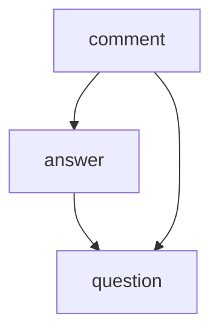

# Domain Modeling in Golang type system
Design architecture to make:
- State management - easy
- Restricting programs - easy
- Scalability of teams and solutions - easy

Few inspirations:
> Parsing preserve information, validation don't.
- [Parse, don't validate](https://lexi-lambda.github.io/blog/2019/11/05/parse-don-t-validate/)

> taxonomies are useful for documenting a domain of interest, but not necessarily helpful for modeling it
> Primarily, types distinguish functional differences between values. A value of type NonEmpty a is functionally distinct from a value of type [a], since it is fundamentally structurally different and permits additional operations. In this sense, types are structural; they describe what values are in the internal world of the programming language.
> Secondarily, we sometimes use types to help ourselves avoid making logical mistakes. We might use separate Distance and Duration types to avoid accidentally doing something nonsensical like adding them together, even though they’re both representationally real numbers.
- [Names are not type sefty](https://lexi-lambda.github.io/blog/2020/11/01/names-are-not-type-safety/)

> type system and checking is just a tool
- [Names are not type sefty](https://lexi-lambda.github.io/blog/2020/11/01/names-are-not-type-safety/)

We shoudn't write code to limit ourself too much

---

Re use types across modules?
- To specific `type Some string` 
- GraphQL federation

```
// DATA in
POST /some-action
{"some":"input"}

// Framework handles
rq := ParseHTTP()
shape := ParseJSON(rq.Body)

// Essence
dom:=ParseDomain(shape)
int:=InterpretDomain()
res:=ExecuteDomain(dom,int)

// Framework
body = EncodeJSON(res)
SendHTTP(body)

// DATA out
HTTP 200
{success:}
```

More expand verions

```
// DATA in

POST /some-action
{"some":"input"}

// Framework handles
rq := ParseHTTP()
shape := ParseJSON(rq.Body)

// Essence

// value objects, available to other sub-domains? - or how to compose subdomains?
domain_tokens := Money | Dimension | 
domain_object := { primitive + domain_tokens + domain_object} 

dom:=ParseDomain(shape) DomObj {
    DomObj.<field> = ParseValueObject(shape.value)
}

int:=InterpretDomainA() {
    HandleCreateX() {
        // create other domain objects
        // invoke other interpreters? or execute other domain objects
        // expand or reduce domain execution
        // communicate with storage
        // - builds SQL (express change in domain language)
        // - maps back results
        // ---- storage layer like SQL parse everything once again and valdates integrity and constraings
        // 
        // Where is integrity constrains check in this model?
    }
}

res:=ExecuteDomainA(dom,int) 

// Framework

body = EncodeJSON(res)
SendHTTP(body)

// DATA out

HTTP 200
{success:}

```

------
### hoe example domain could look like?

   question
   - id : question_id
   - author: user_id
   - content: text

   answer
   - id: answer_id
   - author: user_id
   - question: question_id  
   - content: text

   comment
   - id:comment_id
   - author: user_id
   - content: text
   - created|updated|deleted : date

   ref_has_comment
   - object_ref: question_id | answer_id
   - comment_ref: comment_id

-- view requirements

   question_feed_view: {filter_by: [user_id, number_of_answers], sort_by: [created_at]}
   - question_ref: question_id
   - question_author_ref: user_id
   - question_created: date
   - number_of_answers: int
   - number_of_question_comments: int
   - number_of_answer_comments: int

   how to keep it with sync?
   - optimistic UI
   - streaming, CDCs
   
   how to make it fast, without overcomplicated state management?
   - materialise views - requires batch updates - eventual consistency
   - projections re-building with streaming, CDCs, event sourcing, outbox pattern + events - eventual consistency
   - HTAP databases - eventual consistency
   
   how to make it?
   - joins - via SQL
   - aggregations on API Gateway like GraphQL for simplere 1:1 aggregates can be faster
   - backend for frontend with their own state management - write through back-end for frontend?
 
## how to structure team ownership and independence in monorepo?

- soft delete is interesting decision
  do we really need to validate whenever question exits when posting comment? 
  imagine that we now try to separate part of the system and `comment.add` requires do remote API call, no longer is part of DB
  imagine that we approach external communication and internal communication in the same way, 
  What we loose?
  - transactionality that database gives us, now we have to have process manager, transaction mangers, sagas,..
  - aggregation of data now requires writing JOIN, GROUP BY instead of using them
  What we gain?
  - isolation, independence

- `use case` is concept of transactionality, unit of work that accepted must happen or be rejected.
    - read and write
    - composition of few `source-of-truth`
    - for transactionality can use process manager, sagas
    - offers eventual consistency 
- `source-of-truth` also lower level of transactionality.
    - read and write
    - closes to storage implementation
    - offers strong consistency
- `projection` concept of materialised views, aggregations, indexes
    - read only
    - offers eventual consistency

```
/src
    /use-cases
        /autocomment-new-questions
            @depends(question, fakeuserpool, comment)
            @change("question",{type: "create", bufferOrFlush: [1min, 1000]})
            run() {
                for q : =questions.getList(cursor(order(newest), filter("no_answers".eq(0)), limit(100)) {
                    user := fakeuserpool.CreateNew()
                    comment.CreateComment({type: "question",
                                           object: q.ID,
                                           author: user.ID,
                                           comment: "Amazing!")
                }
            }
    /projections
        /question_feed_postgres
            @materialise(refresh: 1m) {
               CREATE MATERIALIZED VIEW question_feed AS
                  SELECT
                      COUNT() as number_of_answers,
                      COUNT() as number_of_question_comments,
                      COUNT() as number_of_answer_comments,
                    FROM question 
                    JOIN comments, user
                    GRPUP BY ...
                    ...
                    
                CREATE UNIQUE INDEX question_feed_index
                  ON question_feed (...); 
            }
        /question_feed_elasticsearch
           @stream("cdc-workflow", [questin, comment])
           @change("question", "comment", {bufferOrFlush: [1m, 1000]}) 
           @depends("es", {index: my-project-index"})
           run(changes) {
             for q := changes.question {
                es.index(q.id, {question: q})
             }
             for c := changes.comment {
                es.index(c.questionId, {comments: c})
             }
           }
        /question_feed_etl
            @logstash {
                input  {jdbc {statement => "SELECT * FROM questions JOIN ... "}}
                output {http {url => "elasticsearch://"}} 
            }
    /source-of-truth
        /<question>
            create(input) {
                INSERT INTO question(content,author) 
                     VALUES (:input.content,:input.userId)
            }
            get(input) {
                SELECT * FROM question WHERE id = :input.questionId AND deleted IS NOT NULL
            }
        /<answer>
        /<comment>
            @depends(question, answer, user) 
            add(input) {
                @user := user.get(input.userId)
                switch input.type {
                case "question":
                    @question := question.get(@data.questionId)     
                    self.private-add({type: question, objectId: @question.id, userId: @user.id, comment: input.comment.sanitize()})
                case "answer":
                    @answer := question.get(@data.answerId)     
                    self.private-add({type: answer, objectId: @answer.id, userId: @user.id, comment: input.comment.sanitize()})
            }
            private-add(input) {
                BEGIN TRANSACTION ISOLATION LEVEL SERIALIZABLE READ ONLY DEFERRABLE
                @cid := INSERT INTO comment(author,content) 
                     VALUES (:input.userId, :input.content)
                     RETURNING id
                INSERT INTO ref_has_comment(object_ref, comment_ref)
                     VALUES (@id, :input.type, :input.objectId)
                COMMIT
            }
    /catalog-of-capabilities
        /notifications
        /elasticearch
        /jobqueue
            add-workflow(type, input) {
                INSERT INTO workflow (type, data)
                VALUES (type', input:data)
            }
            execute-workflow(type, input, delegateMethod) {
                @data = SELECT data FROM workflow WHERE id := input.id AND type := type
                if @data.status != "new"; return
                @res = delegateMethod(@data)
                UPDATE workflow SET status="ok", res=@res WHERE id = @data.id
            }
            @cron("* * * * *")
            @stream("cdc-workflow")
            process(input) {
                switch input {
                Schedule() =>
                    @workflows = SELECT id FROM workflow WHERE status = "new" LIMIT 10
                    @workflows.map( x => self.execute-workflow(x.id))
                    Change(inserts) =>
                    inserts.map( x => self.execute-workflow(id))
                }
            }
```

let's add as a new requirements points or other business constrain

---

let's take a look at ownership and types of team topologies that can be modeled in this structure of document


#### Feature separation of teams

```
  TEAM A
  (question ownership end to end)
  
  /src
    /use-cases
      /post-questions
      /moderate-questions
    /projections
      /question-feed
    /source-of-truth
      /questions

  TEAM B
  (comments ownership end to end)
  
  /src
    /use-cases
      /moderate-comment
      /autocomment-new-questions
      /post-comment
    /projections
      /comments-moderators-view
    /source-of-truth
      /comments
      
  INFRA TEAM A
  (core can be imported as dependecies)
  
  src/
    /catalog-of-capabilities
      /notifications
      /elasticearch
      /jobqueue

```

#### Separation by customer workflows

```
  TEAM A 
  (owns backoffice tool for moderator)
  
  /src
    /use-cases
      /moderate-questions
      /moderate-comment
    /projections
      /moderators-actions-view
      /moderators-actions-raport
      /customers-questions-queue
      /comments-moderators-view
    /source-of-truth
      /moderator-actions
      /customer-helpdesk
      
  TEAM B
  (owns customers centric part)
  
  /src
    /use-cases
      /post-question
      /post-comment
    /projections
      /question-feed
    /source-of-truth
      /comments
  
  INFRA TEAM A
  (core can be imported as dependecies)
  
  src/
    /catalog-of-capabilities
      /notifications
      /elasticearch
      /jobqueue

```


#### Separation by ___

```
area A
  // data shape
  user

area B
  // data shape
  question
  extend_user_has_question

  // workflow can span across data areas
  AddQuestion({user, content})

// question can live without comments, 
// but comments without answer don't make sence 
// - explicit dependency direction
data area C
  // data shape
  comment
  extend_question_has_comment
  extend_answer_has_comment  
  
  // workflow can span across data areas
  AddCommentToQuestion({user,question,content})
  AddCommentToAnswer({user,answer,content})

data area D
  answer
  extend_user_has_answer
  
  AddAnswer({user,question,content})

data area E
  points
  extend_user_has_points
  extend_question_has_points

  // Extending data, also should allow changes in DML
  // How many extends would be composed? 
  // Because that would be too complex do via composition/decoration in OOP sense
  // I believe we should have single place that orchestrate such high level concepts
  // Below is example showing complexitiy of decoration
  extend AddQuestion(in@{...,points}, op AddQuestion) {
    question := op.AddQuestion(in)
    if points.getPoints(in.userId, in.points) {
        points.SQL`UPDATE extend_user_has_points SET points -= in.points`
        points.SQL`INSERT extend_question_has_points(question,user_ud) VALUES()`
    }
  }
  // Data ownership is what we should be modeling
  // Process ownership is something that spanes across many domains and requires collaboration
  // clear understanding how domains intertwain and interleave
  // since owner of data may need to change also shared processes, workflows and discuss with PO and team(s)
  // how desired effect should look like - this is also solution to "remove user" example that I have written in one of my notes
  // 
 

// Shared ownership, requires communication nad coordination
// Shared ownership... no AddQuestion is owner of area A, but in opensource maner other teams can contribute and textend behaviour
// and then other team when merge, takes respobsbility for the changes. I know how strante that may sounds,
// but thanks to that it becomes clear who owns what and is realted to single source of truth.
// I can imagine that there may be anomalies that many teams extend or introduce new features to core objects like user, questin,...
// In such cases

/use-case
  /AddQuestion{
    @capability(tx)
    @iam(user)
    @data-area-dependency(question, points) {
      tx := transaction.New()
      question.Insert(tx, question, user.ID)
      points.Subsctract(tx, user.ID, points)
      return tx.Commit()
    }
  }
  /PostCommentQuestion
  /PostCommentAnswer
  /ListQuestions {
   @materialise(m)
   @data-area-dependency(question, comments) { 
      m`SELECT 
        q.id 
      , count(qc.id) number_of_comments
      FROM question q 
      JOIN extend_question_has_comment qc`
    }
  }

```



```

Team A

  /src
    /use-cases
      /AddQuestion
      /ListQuestions
    /source-of-truth
      /question
      
Team C

  /src
    /use-cases
      /PostCommentQuestion
      /PostCommentAnswer
    /source-of-truth
      /comment

Team C
      
  /src
    /use-cases
    /source-of-truth
      /answer
  
  INFRA TEAM A
  (core can be imported as dependecies)
  
  src/
    /catalog-of-capabilities
      /notifications
      /elasticearch
      /jobqueue

```


---

Data composibility - alow quicly other teams benefit form new information, like with SQL - JOIN tables
Separate by customer,  but don't rush - 
  sharing of APIs reasone because it "it's harderer to build new set of joins and expose data" 
  - but what if it woudn't be the case?
  and keeping single source of truth would also won't suffer and scalability would be linear

---

We discuss in community about linear scalability, bit how expotencial would look like?

---

Code generation at B for μservice is interesting productivity gain, but one step further is 
how can we then remove what engineers need to generate and maintain nad upload only business logic
and runtime we be updated and managed by other team?


---

What if we would have something like external tables...
What if cost of joining or using external tables would be close to zero

Then if one team has some concept, other team can extend it to
- extend all object in table (question -> extend_question_has_subject)
- extend some objects in table (question -> extend_question_with_answer)
- build bigger structures (subject table -> question)

Then if one team change state of object, other team don't need to know about it? because they already have neves state - false statement?.
- What if someone change content of object, and such object needs to be process via ML to check whenever it is a spam/toxic/etc
- To not need to know about change, then we would need to have something like dynamic columns, that when version change we compute newer version of value
  To avoid performance bottelneck when somone would do aggregation for such columns, then we would need to have dependency graph, to know 
  Whenever there are views that are rebuild when field changes, but then they can batch updates to those dynamic fields
  
```
--- TEAM A
CREATE TABLE question (
  id uuid
  content string
  content_toxic dynamic -- always nullable, cannot be written directly
)

CREATE VIEW question_feed
  SELECT content
  FROM question
  WHERE
    content_toxic < 10%;

--- materialized view knows that field is dynamic, 
    and it handles operations

SELECT content FROM question_feed LIMIT 10;

CREATE STREAM question_changes
  SELECT content
  FROM question
  EMIT CHANGES;

SELECT content FROM question_changes

CREATE RESOLVER 
  LAMBDA dom:sub-domain:lambda:content-toxicity
  ON question.content_toxic
 
--- TEAM B 

CREATE TABLE moderations (
  id uuid
  questionId
  reportedID
  moderatorAction
  moderatorID
)

CREATE VIEW moderation_feed
  SELECT
  FROM moderations
  JOIN question_changes EMIT(1m,100records)  

```
